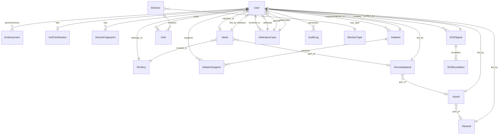

# Data Model & Database Schema

## Overview

This document defines the complete data model for the Girchi Digital Polis platform, including all entities, relationships, and database schema design.

## Entity Relationship Diagram

## Core Entities

### 1. User

The central entity representing all platform users.

**Table**: `users`

| Column | Type | Constraints | Description |
|--------|------|-------------|-------------|
| id | UUID | PK | Unique identifier |
| phone_number | VARCHAR(20) | UNIQUE, NOT NULL | Verified phone number |
| phone_verified_at | TIMESTAMP | NULL | Phone verification timestamp |
| personal_id_hash | VARCHAR(255) | UNIQUE, NOT NULL | Hashed personal ID number |
| role | ENUM | NOT NULL | unverified, geder, supporter |
| status | ENUM | NULL | passive, active (NULL for unverified) |
| is_diaspora | BOOLEAN | DEFAULT FALSE | Diaspora member flag |
| territory_id | UUID | FK, NULL | Reference to territory |
| ateuli_id | UUID | FK, NULL | Reference to Ateuli group |
| tavdebi_id | UUID | FK, NULL | Reference to endorsing GeDer (for supporters) |
| constitution_agreed_at | TIMESTAMP | NULL | Constitution agreement timestamp |
| onboarding_completed_at | TIMESTAMP | NULL | Onboarding completion timestamp |
| onboarding_motivation | TEXT | NULL | Why they joined |
| created_at | TIMESTAMP | NOT NULL | Registration timestamp |
| updated_at | TIMESTAMP | NOT NULL | Last update timestamp |
| deleted_at | TIMESTAMP | NULL | Soft delete timestamp |

**Indexes**:
- `idx_users_phone_number` on `phone_number`
- `idx_users_personal_id_hash` on `personal_id_hash`
- `idx_users_role` on `role`
- `idx_users_territory_id` on `territory_id`
- `idx_users_ateuli_id` on `ateuli_id`
- `idx_users_tavdebi_id` on `tavdebi_id`

**Constraints**:
- `check_supporter_has_tavdebi`: If role = 'supporter', tavdebi_id must NOT be NULL
- `check_status_for_verified`: If role != 'unverified', status must NOT be NULL

---

### 2. GeDVerification

Stores GeD membership verification data.

**Table**: `ged_verifications`

| Column | Type | Constraints | Description |
|--------|------|-------------|-------------|
| id | UUID | PK | Unique identifier |
| user_id | UUID | FK, UNIQUE, NOT NULL | Reference to user |
| ged_number | VARCHAR(50) | UNIQUE, NOT NULL | GeD membership number |
| verified_at | TIMESTAMP | NOT NULL | Verification timestamp |
| verified_by | VARCHAR(100) | NULL | Verification source/method |
| expires_at | TIMESTAMP | NULL | GeD expiration date |
| created_at | TIMESTAMP | NOT NULL | Record creation timestamp |

**Indexes**:
- `idx_ged_verifications_user_id` on `user_id`
- `idx_ged_verifications_ged_number` on `ged_number`

---

### 3. DeviceFingerprint

Tracks devices to prevent duplicate accounts and fraud.

**Table**: `device_fingerprints`

| Column | Type | Constraints | Description |
|--------|------|-------------|-------------|
| id | UUID | PK | Unique identifier |
| user_id | UUID | FK, NOT NULL | Reference to user |
| fingerprint_hash | VARCHAR(255) | NOT NULL | Hashed device fingerprint |
| device_type | VARCHAR(50) | NULL | ios, android, web |
| device_model | VARCHAR(100) | NULL | Device model info |
| os_version | VARCHAR(50) | NULL | Operating system version |
| app_version | VARCHAR(50) | NULL | App version |
| first_seen_at | TIMESTAMP | NOT NULL | First use timestamp |
| last_seen_at | TIMESTAMP | NOT NULL | Last use timestamp |
| is_blocked | BOOLEAN | DEFAULT FALSE | Blocked device flag |
| created_at | TIMESTAMP | NOT NULL | Record creation timestamp |

**Indexes**:
- `idx_device_fingerprints_user_id` on `user_id`
- `idx_device_fingerprints_hash` on `fingerprint_hash`

---

### 4. Endorsement

Tracks GeDer endorsements of supporters (Tavdebi relationship).

**Table**: `endorsements`

| Column | Type | Constraints | Description |
|--------|------|-------------|-------------|
| id | UUID | PK | Unique identifier |
| geder_id | UUID | FK, NOT NULL | Reference to endorsing GeDer |
| supporter_id | UUID | FK, UNIQUE, NOT NULL | Reference to endorsed supporter |
| status | ENUM | NOT NULL | pending, approved, rejected, revoked |
| requested_at | TIMESTAMP | NOT NULL | Endorsement request timestamp |
| approved_at | TIMESTAMP | NULL | Approval timestamp |
| revoked_at | TIMESTAMP | NULL | Revocation timestamp |
| revocation_reason | TEXT | NULL | Reason for revocation |
| penalty_applied | BOOLEAN | DEFAULT FALSE | Penalty flag for fake endorsement |
| created_at | TIMESTAMP | NOT NULL | Record creation timestamp |
| updated_at | TIMESTAMP | NOT NULL | Last update timestamp |

**Indexes**:
- `idx_endorsements_geder_id` on `geder_id`
- `idx_endorsements_supporter_id` on `supporter_id`
- `idx_endorsements_status` on `status`

**Constraints**:
- `check_endorsement_roles`: geder must have role='geder', supporter must have role='supporter'

---

### 5. Territory

Represents electoral districts and geographic organization.

**Table**: `territories`

| Column | Type | Constraints | Description |
|--------|------|-------------|-------------|
| id | UUID | PK | Unique identifier |
| name | VARCHAR(200) | NOT NULL | Territory name (Georgian) |
| name_en | VARCHAR(200) | NULL | Territory name (English) |
| type | ENUM | NOT NULL | electoral_district, region, municipality |
| parent_id | UUID | FK, NULL | Parent territory (hierarchical) |
| code | VARCHAR(50) | UNIQUE, NULL | Official territory code |
| geometry | GEOMETRY | NULL | Geographic boundary (PostGIS) |
| created_at | TIMESTAMP | NOT NULL | Record creation timestamp |
| updated_at | TIMESTAMP | NOT NULL | Last update timestamp |

**Indexes**:
- `idx_territories_parent_id` on `parent_id`
- `idx_territories_code` on `code`
- `idx_territories_type` on `type`
- Spatial index on `geometry` (PostGIS)

---

### 6. Ateuli

Group of 10 members (basic organizational unit).

**Table**: `ateulis`

| Column | Type | Constraints | Description |
|--------|------|-------------|-------------|
| id | UUID | PK | Unique identifier |
| name | VARCHAR(200) | NULL | Optional group name |
| territory_id | UUID | FK, NOT NULL | Reference to territory |
| atistavi_id | UUID | FK, NULL | Reference to elected leader |
| ormotsdaateuli_id | UUID | FK, NULL | Parent group (50) |
| member_count | INTEGER | DEFAULT 0 | Current member count |
| status | ENUM | NOT NULL | forming, active, inactive |
| created_at | TIMESTAMP | NOT NULL | Formation timestamp |
| updated_at | TIMESTAMP | NOT NULL | Last update timestamp |

**Indexes**:
- `idx_ateulis_territory_id` on `territory_id`
- `idx_ateulis_atistavi_id` on `atistavi_id`
- `idx_ateulis_ormotsdaateuli_id` on `ormotsdaateuli_id`
- `idx_ateulis_status` on `status`

**Constraints**:
- `check_member_count`: member_count >= 0 AND member_count <= 10

---

### 7. Ormotsdaateuli

Group of 50 members (5 Ateulis).

**Table**: `ormotsdaateulis`

| Column | Type | Constraints | Description |
|--------|------|-------------|-------------|
| id | UUID | PK | Unique identifier |
| name | VARCHAR(200) | NULL | Optional group name |
| territory_id | UUID | FK, NOT NULL | Reference to territory |
| leader_id | UUID | FK, NULL | Reference to elected leader |
| aseuli_id | UUID | FK, NULL | Parent group (100) |
| ateuli_count | INTEGER | DEFAULT 0 | Number of Ateulis |
| member_count | INTEGER | DEFAULT 0 | Total member count |
| status | ENUM | NOT NULL | forming, active, inactive |
| created_at | TIMESTAMP | NOT NULL | Formation timestamp |
| updated_at | TIMESTAMP | NOT NULL | Last update timestamp |

**Indexes**:
- `idx_ormotsdaateulis_territory_id` on `territory_id`
- `idx_ormotsdaateulis_leader_id` on `leader_id`
- `idx_ormotsdaateulis_aseuli_id` on `aseuli_id`

**Constraints**:
- `check_ateuli_count`: ateuli_count >= 0 AND ateuli_count <= 5

---

### 8. Aseuli

Group of 100 members (10 Ateulis or 2 Ormotsdaateulis).

**Table**: `aseulis`

| Column | Type | Constraints | Description |
|--------|------|-------------|-------------|
| id | UUID | PK | Unique identifier |
| name | VARCHAR(200) | NULL | Optional group name |
| territory_id | UUID | FK, NOT NULL | Reference to territory |
| asistavi_id | UUID | FK, NULL | Reference to elected leader |
| ataseuli_id | UUID | FK, NULL | Parent group (1000) |
| ormotsdaateuli_count | INTEGER | DEFAULT 0 | Number of Ormotsdaateulis |
| member_count | INTEGER | DEFAULT 0 | Total member count |
| status | ENUM | NOT NULL | forming, active, inactive |
| created_at | TIMESTAMP | NOT NULL | Formation timestamp |
| updated_at | TIMESTAMP | NOT NULL | Last update timestamp |

**Indexes**:
- `idx_aseulis_territory_id` on `territory_id`
- `idx_aseulis_asistavi_id` on `asistavi_id`
- `idx_aseulis_ataseuli_id` on `ataseuli_id`

---

### 9. Ataseuli

Group of 1000 members (10 Aseulis).

**Table**: `ataseulis`

| Column | Type | Constraints | Description |
|--------|------|-------------|-------------|
| id | UUID | PK | Unique identifier |
| name | VARCHAR(200) | NULL | Optional group name |
| territory_id | UUID | FK, NOT NULL | Reference to territory |
| atasistavi_id | UUID | FK, NULL | Reference to elected leader |
| aseuli_count | INTEGER | DEFAULT 0 | Number of Aseulis |
| member_count | INTEGER | DEFAULT 0 | Total member count |
| status | ENUM | NOT NULL | forming, active, inactive |
| budget_amount | DECIMAL(15,2) | DEFAULT 0 | Allocated budget |
| created_at | TIMESTAMP | NOT NULL | Formation timestamp |
| updated_at | TIMESTAMP | NOT NULL | Last update timestamp |

**Indexes**:
- `idx_ataseulis_territory_id` on `territory_id`
- `idx_ataseulis_atasistavi_id` on `atasistavi_id`

**Constraints**:
- `check_aseuli_count`: aseuli_count >= 0 AND aseuli_count <= 10

---

### 10. Election

Represents elections at various levels.

**Table**: `elections`

| Column | Type | Constraints | Description |
|--------|------|-------------|-------------|
| id | UUID | PK | Unique identifier |
| election_type | ENUM | NOT NULL | atistavi, ormotsdaatistavi, asistavi, atasistavi, parliamentary |
| scope_type | ENUM | NOT NULL | ateuli, ormotsdaateuli, aseuli, ataseuli, national |
| scope_id | UUID | NULL | Reference to scope entity |
| title | VARCHAR(300) | NOT NULL | Election title |
| description | TEXT | NULL | Election description |
| starts_at | TIMESTAMP | NOT NULL | Voting start time |
| ends_at | TIMESTAMP | NOT NULL | Voting end time |
| status | ENUM | NOT NULL | scheduled, active, completed, cancelled |
| winner_id | UUID | FK, NULL | Reference to winning user |
| total_votes | INTEGER | DEFAULT 0 | Total votes cast |
| created_at | TIMESTAMP | NOT NULL | Record creation timestamp |
| updated_at | TIMESTAMP | NOT NULL | Last update timestamp |

**Indexes**:
- `idx_elections_election_type` on `election_type`
- `idx_elections_scope_type_id` on `(scope_type, scope_id)`
- `idx_elections_status` on `status`
- `idx_elections_dates` on `(starts_at, ends_at)`

---

### 11. ElectionCandidate

Candidates in elections.

**Table**: `election_candidates`

| Column | Type | Constraints | Description |
|--------|------|-------------|-------------|
| id | UUID | PK | Unique identifier |
| election_id | UUID | FK, NOT NULL | Reference to election |
| user_id | UUID | FK, NOT NULL | Reference to candidate |
| statement | TEXT | NULL | Candidate statement |
| vote_count | INTEGER | DEFAULT 0 | Votes received |
| registered_at | TIMESTAMP | NOT NULL | Candidacy registration time |
| created_at | TIMESTAMP | NOT NULL | Record creation timestamp |

**Indexes**:
- `idx_election_candidates_election_id` on `election_id`
- `idx_election_candidates_user_id` on `user_id`
- `unique_candidate_per_election` UNIQUE on `(election_id, user_id)`

---

### 12. Vote

Individual votes cast in elections.

**Table**: `votes`

| Column | Type | Constraints | Description |
|--------|------|-------------|-------------|
| id | UUID | PK | Unique identifier |
| election_id | UUID | FK, NOT NULL | Reference to election |
| voter_id | UUID | FK, NOT NULL | Reference to voter |
| candidate_id | UUID | FK, NOT NULL | Reference to candidate |
| vote_hash | VARCHAR(255) | NOT NULL | Vote verification hash |
| cast_at | TIMESTAMP | NOT NULL | Vote timestamp |
| created_at | TIMESTAMP | NOT NULL | Record creation timestamp |

**Indexes**:
- `idx_votes_election_id` on `election_id`
- `idx_votes_voter_id` on `voter_id`
- `idx_votes_candidate_id` on `candidate_id`
- `unique_vote_per_election` UNIQUE on `(election_id, voter_id)`

---

### 13. SOSSignal

Emergency signals for injustice cases.

**Table**: `sos_signals`

| Column | Type | Constraints | Description |
|--------|------|-------------|-------------|
| id | UUID | PK | Unique identifier |
| reporter_id | UUID | FK, NOT NULL | Reference to reporting user |
| title | VARCHAR(300) | NOT NULL | Signal title |
| description | TEXT | NOT NULL | Detailed description |
| location | VARCHAR(300) | NULL | Incident location |
| moral_filter_response | TEXT | NOT NULL | Response to moral filter question |
| status | ENUM | NOT NULL | pending, verified, escalated, resolved, rejected |
| priority | ENUM | DEFAULT 'normal' | low, normal, high, critical |
| verifier_id | UUID | FK, NULL | Reference to verifying Atistavi |
| verified_at | TIMESTAMP | NULL | Verification timestamp |
| verification_notes | TEXT | NULL | Verifier's notes |
| current_level | ENUM | NOT NULL | ateuli, ormotsdaateuli, aseuli, ataseuli, media |
| created_at | TIMESTAMP | NOT NULL | Signal creation timestamp |
| updated_at | TIMESTAMP | NOT NULL | Last update timestamp |
| resolved_at | TIMESTAMP | NULL | Resolution timestamp |

**Indexes**:
- `idx_sos_signals_reporter_id` on `reporter_id`
- `idx_sos_signals_verifier_id` on `verifier_id`
- `idx_sos_signals_status` on `status`
- `idx_sos_signals_priority` on `priority`
- `idx_sos_signals_created_at` on `created_at`

---

### 14. SOSEscalation

Tracks SOS signal escalation through hierarchy.

**Table**: `sos_escalations`

| Column | Type | Constraints | Description |
|--------|------|-------------|-------------|
| id | UUID | PK | Unique identifier |
| signal_id | UUID | FK, NOT NULL | Reference to SOS signal |
| from_level | ENUM | NOT NULL | Source level |
| to_level | ENUM | NOT NULL | Target level |
| escalated_by_id | UUID | FK, NOT NULL | Reference to escalating user |
| escalated_at | TIMESTAMP | NOT NULL | Escalation timestamp |
| notes | TEXT | NULL | Escalation notes |
| created_at | TIMESTAMP | NOT NULL | Record creation timestamp |

**Indexes**:
- `idx_sos_escalations_signal_id` on `signal_id`
- `idx_sos_escalations_escalated_by_id` on `escalated_by_id`

---

### 15. Initiative

Community initiatives and petitions.

**Table**: `initiatives`

| Column | Type | Constraints | Description |
|--------|------|-------------|-------------|
| id | UUID | PK | Unique identifier |
| creator_id | UUID | FK, NOT NULL | Reference to creator |
| title | VARCHAR(300) | NOT NULL | Initiative title |
| description | TEXT | NOT NULL | Detailed description |
| category | ENUM | NOT NULL | education, infrastructure, social, economic, other |
| scope_type | ENUM | NOT NULL | ateuli, ormotsdaateuli, aseuli, ataseuli, national |
| scope_id | UUID | NULL | Reference to scope entity |
| target_support | INTEGER | NOT NULL | Required support count |
| current_support | INTEGER | DEFAULT 0 | Current support count |
| status | ENUM | NOT NULL | draft, active, achieved, assigned, completed, rejected |
| assigned_to_id | UUID | FK, NULL | Reference to assigned representative |
| assigned_at | TIMESTAMP | NULL | Assignment timestamp |
| completed_at | TIMESTAMP | NULL | Completion timestamp |
| created_at | TIMESTAMP | NOT NULL | Initiative creation timestamp |
| updated_at | TIMESTAMP | NOT NULL | Last update timestamp |

**Indexes**:
- `idx_initiatives_creator_id` on `creator_id`
- `idx_initiatives_category` on `category`
- `idx_initiatives_scope_type_id` on `(scope_type, scope_id)`
- `idx_initiatives_status` on `status`
- `idx_initiatives_assigned_to_id` on `assigned_to_id`

---

### 16. InitiativeSupport

User support for initiatives.

**Table**: `initiative_supports`

| Column | Type | Constraints | Description |
|--------|------|-------------|-------------|
| id | UUID | PK | Unique identifier |
| initiative_id | UUID | FK, NOT NULL | Reference to initiative |
| supporter_id | UUID | FK, NOT NULL | Reference to supporting user |
| comment | TEXT | NULL | Optional support comment |
| supported_at | TIMESTAMP | NOT NULL | Support timestamp |
| created_at | TIMESTAMP | NOT NULL | Record creation timestamp |

**Indexes**:
- `idx_initiative_supports_initiative_id` on `initiative_id`
- `idx_initiative_supports_supporter_id` on `supporter_id`
- `unique_support_per_initiative` UNIQUE on `(initiative_id, supporter_id)`

---

### 17. ArbitrationCase

Dispute resolution cases.

**Table**: `arbitration_cases`

| Column | Type | Constraints | Description |
|--------|------|-------------|-------------|
| id | UUID | PK | Unique identifier |
| case_number | VARCHAR(50) | UNIQUE, NOT NULL | Unique case identifier |
| plaintiff_id | UUID | FK, NOT NULL | Reference to plaintiff |
| defendant_id | UUID | FK, NOT NULL | Reference to defendant |
| arbitrator_id | UUID | FK, NULL | Reference to arbitrator |
| title | VARCHAR(300) | NOT NULL | Case title |
| description | TEXT | NOT NULL | Case description |
| status | ENUM | NOT NULL | pending, assigned, in_progress, resolved, appealed |
| resolution | TEXT | NULL | Arbitrator's resolution |
| resolved_at | TIMESTAMP | NULL | Resolution timestamp |
| created_at | TIMESTAMP | NOT NULL | Case creation timestamp |
| updated_at | TIMESTAMP | NOT NULL | Last update timestamp |

**Indexes**:
- `idx_arbitration_cases_case_number` on `case_number`
- `idx_arbitration_cases_plaintiff_id` on `plaintiff_id`
- `idx_arbitration_cases_defendant_id` on `defendant_id`
- `idx_arbitration_cases_arbitrator_id` on `arbitrator_id`
- `idx_arbitration_cases_status` on `status`

---

### 18. AuditLog

Comprehensive audit trail for all critical actions.

**Table**: `audit_logs`

| Column | Type | Constraints | Description |
|--------|------|-------------|-------------|
| id | UUID | PK | Unique identifier |
| user_id | UUID | FK, NULL | Reference to acting user |
| action | VARCHAR(100) | NOT NULL | Action type |
| entity_type | VARCHAR(100) | NOT NULL | Affected entity type |
| entity_id | UUID | NULL | Affected entity ID |
| old_values | JSONB | NULL | Previous values |
| new_values | JSONB | NULL | New values |
| ip_address | INET | NULL | User IP address |
| user_agent | TEXT | NULL | User agent string |
| created_at | TIMESTAMP | NOT NULL | Action timestamp |

**Indexes**:
- `idx_audit_logs_user_id` on `user_id`
- `idx_audit_logs_action` on `action`
- `idx_audit_logs_entity` on `(entity_type, entity_id)`
- `idx_audit_logs_created_at` on `created_at`

---

### 19. Notification

User notifications.

**Table**: `notifications`

| Column | Type | Constraints | Description |
|--------|------|-------------|-------------|
| id | UUID | PK | Unique identifier |
| user_id | UUID | FK, NOT NULL | Reference to recipient |
| type | VARCHAR(100) | NOT NULL | Notification type |
| title | VARCHAR(300) | NOT NULL | Notification title |
| message | TEXT | NOT NULL | Notification message |
| data | JSONB | NULL | Additional data |
| read_at | TIMESTAMP | NULL | Read timestamp |
| created_at | TIMESTAMP | NOT NULL | Notification creation timestamp |

**Indexes**:
- `idx_notifications_user_id` on `user_id`
- `idx_notifications_type` on `type`
- `idx_notifications_read_at` on `read_at`
- `idx_notifications_created_at` on `created_at`

---

## Enumerations

### UserRole
- `unverified`: Newly registered, not verified
- `geder`: Verified GeD holder
- `supporter`: Endorsed by GeDer

### UserStatus
- `passive`: Can vote, cannot lead
- `active`: Can vote and become leader

### EndorsementStatus
- `pending`: Awaiting approval
- `approved`: Endorsement active
- `rejected`: Endorsement denied
- `revoked`: Endorsement cancelled

### TerritoryType
- `electoral_district`: Electoral district
- `region`: Administrative region
- `municipality`: Municipality

### GroupStatus
- `forming`: Not yet complete
- `active`: Fully operational
- `inactive`: Disbanded or inactive

### ElectionType
- `atistavi`: Leader of 10
- `ormotsdaatistavi`: Leader of 50
- `asistavi`: Leader of 100
- `atasistavi`: Leader of 1000
- `parliamentary`: Parliamentary list

### ElectionScopeType
- `ateuli`: Group of 10
- `ormotsdaateuli`: Group of 50
- `aseuli`: Group of 100
- `ataseuli`: Group of 1000
- `national`: National level

### ElectionStatus
- `scheduled`: Not yet started
- `active`: Currently ongoing
- `completed`: Finished
- `cancelled`: Cancelled

### SOSStatus
- `pending`: Awaiting verification
- `verified`: Verified by Atistavi
- `escalated`: Escalated to higher level
- `resolved`: Case resolved
- `rejected`: Not legitimate

### SOSPriority
- `low`: Low priority
- `normal`: Normal priority
- `high`: High priority
- `critical`: Critical priority

### HierarchyLevel
- `ateuli`: Group of 10
- `ormotsdaateuli`: Group of 50
- `aseuli`: Group of 100
- `ataseuli`: Group of 1000
- `media`: Escalated to media

### InitiativeCategory
- `education`: Education-related
- `infrastructure`: Infrastructure projects
- `social`: Social initiatives
- `economic`: Economic initiatives
- `other`: Other categories

### InitiativeStatus
- `draft`: Being prepared
- `active`: Collecting support
- `achieved`: Reached target support
- `assigned`: Assigned to representative
- `completed`: Initiative completed
- `rejected`: Initiative rejected

### ArbitrationStatus
- `pending`: Awaiting assignment
- `assigned`: Arbitrator assigned
- `in_progress`: Under review
- `resolved`: Case resolved
- `appealed`: Resolution appealed

---

## Key Relationships

### User Relationships
1. **User → GeDVerification** (1:0..1): GeDers have verification record
2. **User → DeviceFingerprint** (1:N): Users can have multiple devices
3. **User → Territory** (N:1): Users belong to one territory
4. **User → Ateuli** (N:0..1): Users may belong to one Ateuli
5. **User → User (Tavdebi)** (N:0..1): Supporters have one Tavdebi (GeDer)

### Endorsement Relationships
1. **GeDer → Endorsement** (1:N): GeDers can endorse multiple supporters (limited)
2. **Supporter → Endorsement** (1:1): Each supporter has one endorsement

### Hierarchical Relationships
1. **Ateuli → Ormotsdaateuli** (5:1): 5 Ateulis form one Ormotsdaateuli
2. **Ormotsdaateuli → Aseuli** (2:1): 2 Ormotsdaateulis form one Aseuli
3. **Aseuli → Ataseuli** (10:1): 10 Aseulis form one Ataseuli

### Leadership Relationships
1. **Ateuli → User (Atistavi)** (1:0..1): Each Ateuli has one elected leader
2. **Ormotsdaateuli → User** (1:0..1): Each Ormotsdaateuli has one elected leader
3. **Aseuli → User (Asistavi)** (1:0..1): Each Aseuli has one elected leader
4. **Ataseuli → User (Atasistavi)** (1:0..1): Each Ataseuli has one elected leader

### Election Relationships
1. **Election → Vote** (1:N): Each election has multiple votes
2. **User → Vote** (1:N): Users cast votes in elections
3. **Election → ElectionCandidate** (1:N): Elections have multiple candidates

### SOS Relationships
1. **User → SOSSignal** (1:N): Users can create multiple SOS signals
2. **SOSSignal → SOSEscalation** (1:N): Signals can be escalated multiple times
3. **User (Atistavi) → SOSSignal (Verifier)** (1:N): Leaders verify signals

### Initiative Relationships
1. **User → Initiative** (1:N): Users can create multiple initiatives
2. **Initiative → InitiativeSupport** (1:N): Initiatives receive multiple supports
3. **User → InitiativeSupport** (1:N): Users can support multiple initiatives

### Arbitration Relationships
1. **User → ArbitrationCase (Plaintiff)** (1:N): Users can file multiple cases
2. **User → ArbitrationCase (Defendant)** (1:N): Users can be defendants in multiple cases
3. **User → ArbitrationCase (Arbitrator)** (1:N): Leaders arbitrate multiple cases

---

## Data Integrity Rules

### Business Logic Constraints

1. **Endorsement Limits**
   - Each GeDer can endorse maximum 5-10 supporters (configurable)
   - Tracked via count of approved endorsements per GeDer

2. **Group Size Limits**
   - Ateuli: exactly 10 members when active
   - Ormotsdaateuli: exactly 5 Ateulis when active
   - Aseuli: exactly 10 Ateulis OR 2 Ormotsdaateulis when active
   - Ataseuli: exactly 10 Aseulis when active

3. **Leadership Eligibility**
   - Only users with status='active' can be leaders
   - Leaders must be members of the group they lead

4. **Voting Eligibility**
   - Only users with role in ('geder', 'supporter') can vote
   - Users can only vote in elections within their scope

5. **Territory Assignment**
   - All non-diaspora users must have territory_id
   - Diaspora users have is_diaspora=true and territory_id=NULL

6. **Endorsement Penalties**
   - When supporter marked as fake, tavdebi loses endorsement rights
   - Penalty tracked in endorsement record

---

## Performance Considerations

### Denormalization
- `member_count` fields in group tables (Ateuli, Ormotsdaateuli, etc.)
- `vote_count` in ElectionCandidate table
- `current_support` in Initiative table

### Caching Strategy
- User role and status (Redis, TTL: 1 hour)
- Territory hierarchy (Redis, TTL: 24 hours)
- Group membership counts (Redis, TTL: 5 minutes)
- Election results (Redis, TTL: varies by election status)

### Partitioning Strategy
- `audit_logs` table partitioned by month
- `notifications` table partitioned by month
- `votes` table partitioned by election_id (hash partitioning)

---

## Security Considerations

### Sensitive Data
- `personal_id_hash`: Encrypted using AES-256
- `phone_number`: Encrypted using AES-256
- `ged_number`: Encrypted using AES-256
- `fingerprint_hash`: One-way hash (SHA-256)

### Access Control
- Row-level security (RLS) for multi-tenant data isolation
- Audit logging for all sensitive operations
- Encrypted backups

### Data Retention
- Soft deletes for users (deleted_at timestamp)
- Audit logs retained for 7 years
- Notifications purged after 90 days (read) or 1 year (unread)
