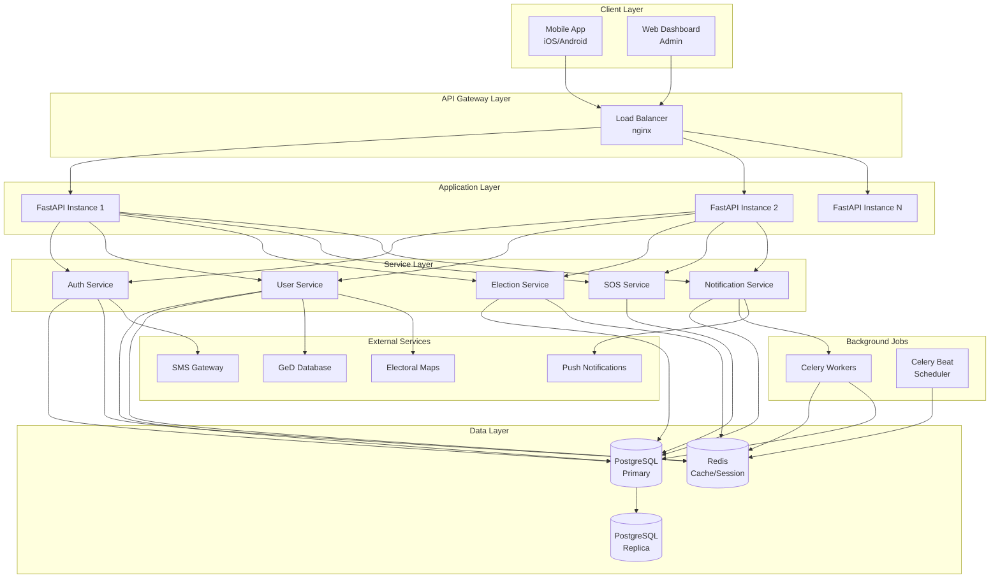
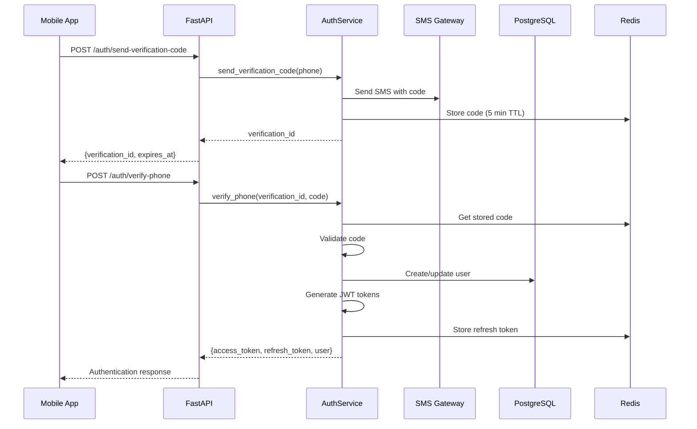
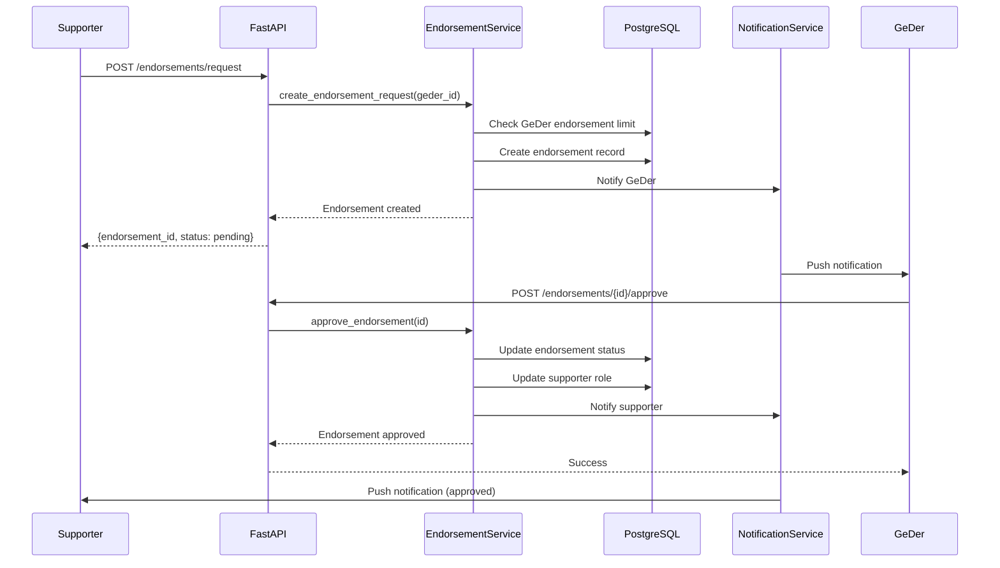
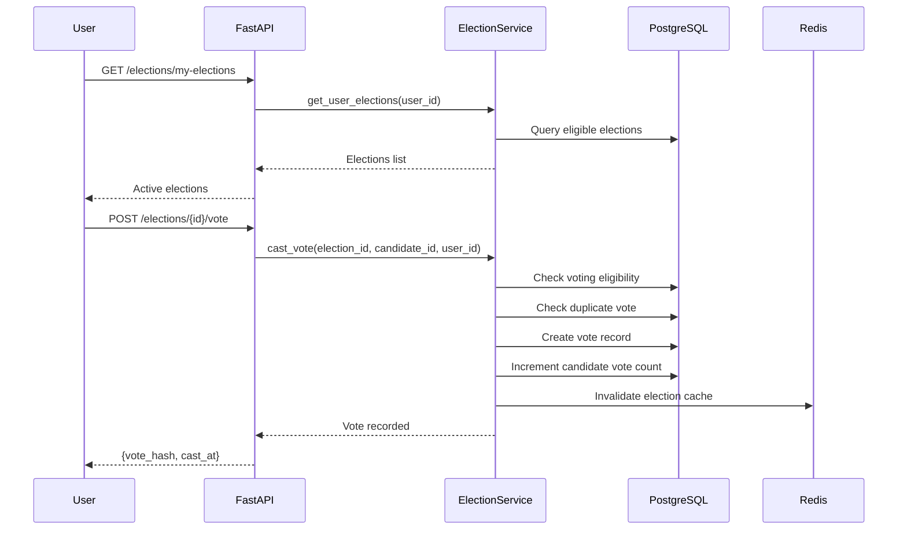
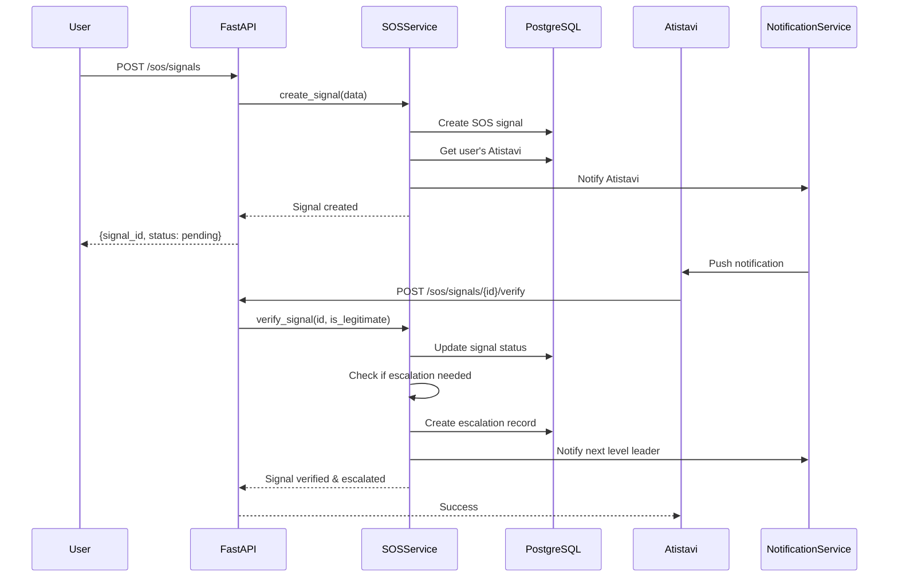
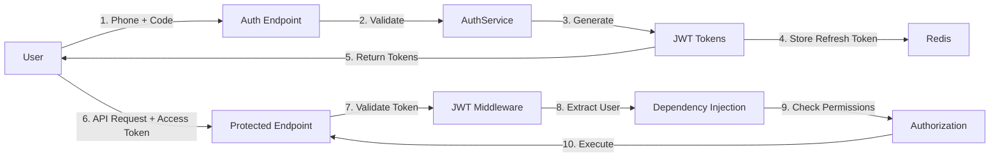

# System Architecture Overview - Girchi Digital Polis

## Executive Summary

The Girchi Digital Polis backend is designed as a modern, scalable API-first architecture built with FastAPI and PostgreSQL. The system supports a mobile application for decentralized society management with hierarchical governance, elections, and community engagement features.

## Architecture Diagram



## Technology Stack

### Backend Framework
- **FastAPI 0.104+**: Modern, high-performance web framework
  - Automatic API documentation (OpenAPI/Swagger)
  - Built-in data validation (Pydantic)
  - Async support for high concurrency
  - Type hints for better IDE support

### Database
- **PostgreSQL 15+**: Primary relational database
  - ACID compliance for data integrity
  - Advanced indexing for performance
  - JSONB support for flexible data
  - PostGIS extension for geographic data
  - Row-level security for multi-tenancy

### Caching & Session Management
- **Redis 7+**: In-memory data store
  - Session storage
  - API response caching
  - Rate limiting
  - Real-time features (pub/sub)
  - Celery message broker

### ORM & Migrations
- **SQLAlchemy 2.0+**: SQL toolkit and ORM
  - Async support
  - Relationship management
  - Query optimization
  - Type safety
- **Alembic**: Database migration tool
  - Version control for schema
  - Rollback capabilities

### Authentication & Security
- **JWT (PyJWT)**: Token-based authentication
  - Stateless authentication
  - Access & refresh tokens
  - Token rotation
- **Bcrypt**: Password hashing
- **Cryptography**: AES-256 encryption for sensitive data

### Background Tasks
- **Celery**: Distributed task queue
  - Async email/SMS sending
  - Scheduled tasks (election reminders)
  - Long-running operations
  - Retry mechanisms

### Testing
- **pytest**: Testing framework
  - Unit tests
  - Integration tests
  - API endpoint tests
- **pytest-asyncio**: Async test support
- **httpx**: Async HTTP client for testing

### Development Tools
- **Docker & Docker Compose**: Containerization
- **Black**: Code formatting
- **Ruff**: Fast Python linter
- **MyPy**: Static type checking

## System Components

### 1. API Layer

#### Responsibilities
- HTTP request handling
- Request validation
- Response formatting
- Authentication/authorization
- Rate limiting
- CORS handling

#### Key Features
- RESTful API design
- Automatic OpenAPI documentation
- Versioned endpoints (`/api/v1/`)
- Consistent error handling
- Request/response logging

### 2. Service Layer

#### Responsibilities
- Business logic implementation
- Data validation
- Transaction management
- External service integration
- Event publishing

#### Key Services

**AuthService**
- Phone verification
- JWT token management
- Device fingerprinting
- Session management

**UserService**
- User registration/onboarding
- Profile management
- GeD verification
- Role/status management

**EndorsementService**
- Endorsement requests
- Approval/rejection workflow
- Limit tracking
- Penalty management

**ElectionService**
- Election creation
- Candidate registration
- Vote casting
- Result calculation

**SOSService**
- Signal creation
- Verification workflow
- Escalation logic
- Priority management

**InitiativeService**
- Initiative creation
- Support tracking
- Assignment logic
- Completion tracking

**NotificationService**
- Notification creation
- Delivery management
- Push notification integration
- Email/SMS integration

### 3. Data Layer

#### Database Schema
- 19 core tables
- Comprehensive indexes
- Foreign key constraints
- Check constraints
- Triggers for audit logging

#### Caching Strategy

**User Data** (TTL: 1 hour)
- User profile
- Role and status
- Permissions

**Territory Data** (TTL: 24 hours)
- Territory hierarchy
- Geographic boundaries

**Election Results** (TTL: varies)
- Active elections: 5 minutes
- Completed elections: 7 days

**Statistics** (TTL: 5 minutes)
- Platform statistics
- Group member counts

### 4. Background Jobs

#### Scheduled Tasks (Celery Beat)
- Daily: User activity reports
- Hourly: Election status updates
- Every 5 min: SOS signal escalation checks
- Weekly: Inactive user cleanup

#### Async Tasks (Celery Workers)
- Send SMS verification codes
- Send push notifications
- Send email notifications
- Generate reports
- Process bulk operations

## Data Flow Examples

### 1. User Registration Flow



### 2. Endorsement Request Flow



### 3. Election Voting Flow



### 4. SOS Signal Escalation Flow



## Security Architecture

### Authentication Flow



### Security Layers

1. **Transport Security**
   - HTTPS only in production
   - TLS 1.3
   - Certificate pinning (mobile app)

2. **Authentication**
   - JWT with short expiry (15 min)
   - Refresh token rotation
   - Device fingerprinting
   - Multi-factor authentication (future)

3. **Authorization**
   - Role-based access control (RBAC)
   - Resource-level permissions
   - Hierarchical permissions (leaders)

4. **Data Protection**
   - Personal ID encryption (AES-256)
   - Phone number hashing
   - Password hashing (bcrypt)
   - Sensitive data masking in logs

5. **API Security**
   - Rate limiting
   - Request validation
   - SQL injection prevention (ORM)
   - XSS prevention
   - CSRF protection

6. **Audit & Monitoring**
   - Comprehensive audit logging
   - Failed authentication tracking
   - Suspicious activity detection
   - Real-time alerting

## Scalability Strategy

### Horizontal Scaling

**Application Tier**
- Stateless FastAPI instances
- Load balancing with nginx
- Auto-scaling based on CPU/memory
- Container orchestration (Kubernetes)

**Database Tier**
- Read replicas for queries
- Connection pooling
- Query optimization
- Partitioning for large tables

**Cache Tier**
- Redis cluster
- Cache warming
- Distributed caching

### Performance Optimization

**Database**
- Proper indexing strategy
- Query optimization
- Denormalization where needed
- Materialized views for complex queries

**API**
- Response caching
- Pagination for large datasets
- Async operations
- Database query batching

**Background Jobs**
- Celery worker scaling
- Task prioritization
- Retry mechanisms
- Dead letter queues

## Monitoring & Observability

### Metrics Collection
- **Prometheus**: Metrics aggregation
  - Request rate
  - Response time
  - Error rate
  - Database connections
  - Cache hit rate

### Visualization
- **Grafana**: Dashboards
  - System health
  - API performance
  - Business metrics
  - User activity

### Logging
- **ELK Stack**: Centralized logging
  - Application logs
  - Access logs
  - Error logs
  - Audit logs

### Alerting
- **AlertManager**: Alert routing
  - High error rate
  - Slow response time
  - Database issues
  - Security incidents

### Tracing
- **OpenTelemetry**: Distributed tracing
  - Request flow tracking
  - Performance bottlenecks
  - Service dependencies

## Deployment Architecture

### Development Environment
```
Docker Compose:
- FastAPI (hot reload)
- PostgreSQL
- Redis
- Adminer (DB UI)
```

### Staging Environment
```
Kubernetes Cluster:
- 2 FastAPI pods
- PostgreSQL (managed service)
- Redis (managed service)
- Celery workers (2 pods)
```

### Production Environment
```
Kubernetes Cluster:
- 5+ FastAPI pods (auto-scaling)
- PostgreSQL (managed, HA)
- Redis Cluster (HA)
- Celery workers (5+ pods, auto-scaling)
- Load Balancer
- CDN (static assets)
```

## Disaster Recovery

### Backup Strategy
- **Database**: Daily full backup, hourly incremental
- **Redis**: Periodic snapshots
- **File Storage**: Geo-redundant storage
- **Retention**: 30 days

### Recovery Procedures
- **RTO (Recovery Time Objective)**: 1 hour
- **RPO (Recovery Point Objective)**: 1 hour
- Automated failover for database
- Multi-region deployment (future)

## Future Enhancements

### Phase 2
- WebSocket support for real-time updates
- GraphQL API for flexible queries
- Advanced analytics dashboard
- Machine learning for fraud detection

### Phase 3
- Blockchain integration for vote verification
- Decentralized identity (DID)
- Multi-language support
- Mobile app offline mode

### Phase 4
- Federation with other societies
- Cross-platform governance
- Advanced gamification
- AI-powered arbitration assistance

## Development Workflow

### Git Workflow
```
main (production)
  ↑
develop (staging)
  ↑
feature/* (development)
```

### CI/CD Pipeline
1. **Code Push**: Developer pushes to feature branch
2. **Automated Tests**: pytest runs all tests
3. **Code Quality**: Linting, type checking
4. **Build**: Docker image creation
5. **Deploy to Dev**: Automatic deployment
6. **Integration Tests**: API tests
7. **PR Review**: Code review required
8. **Merge to Develop**: Deploy to staging
9. **QA Testing**: Manual testing
10. **Merge to Main**: Deploy to production

### Code Quality Standards
- **Test Coverage**: Minimum 80%
- **Type Hints**: Required for all functions
- **Documentation**: Docstrings for all public APIs
- **Code Review**: Required for all PRs
- **Linting**: Black + Ruff
- **Security Scan**: Automated vulnerability scanning

## API Versioning Strategy

### Current Version
- `/api/v1/` - Initial release

### Version Management
- URL-based versioning
- Backward compatibility for 2 versions
- Deprecation warnings in headers
- Migration guides for breaking changes

### Deprecation Process
1. Announce deprecation (3 months notice)
2. Add deprecation headers
3. Update documentation
4. Provide migration guide
5. Remove after deprecation period

## Conclusion

This architecture provides a solid foundation for the Girchi Digital Polis platform with:

✅ **Scalability**: Horizontal scaling at all tiers
✅ **Security**: Multi-layered security approach
✅ **Performance**: Caching and optimization strategies
✅ **Reliability**: High availability and disaster recovery
✅ **Maintainability**: Clean architecture and comprehensive testing
✅ **Observability**: Monitoring, logging, and tracing

The system is designed to grow with the platform, supporting thousands of users initially and scaling to hundreds of thousands as the society expands.
